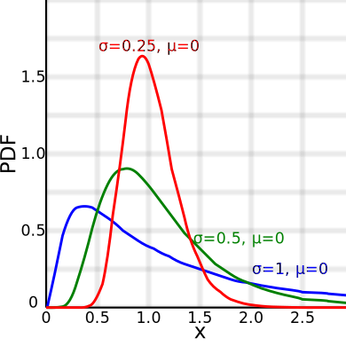
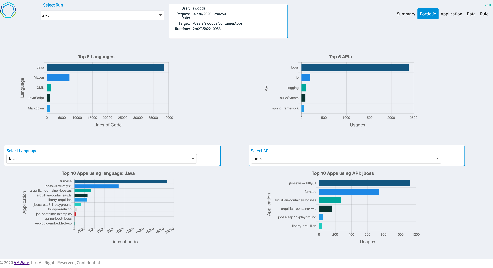
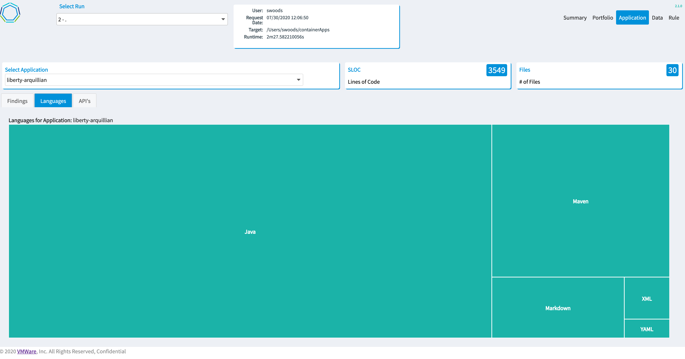
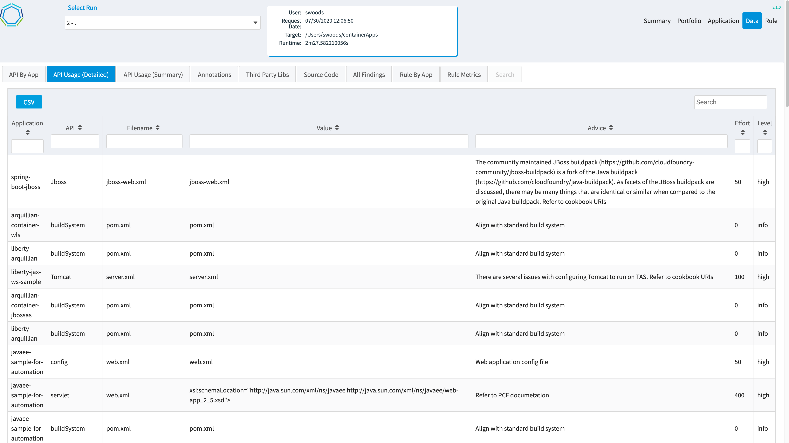
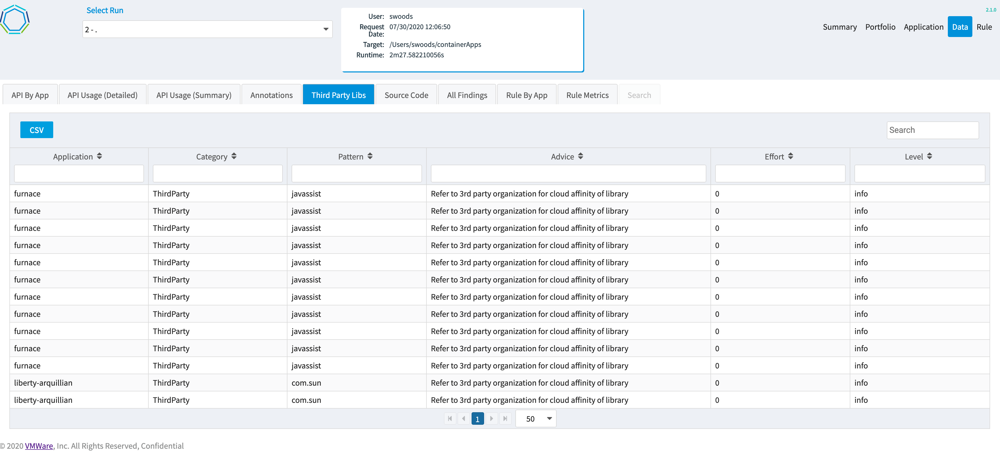
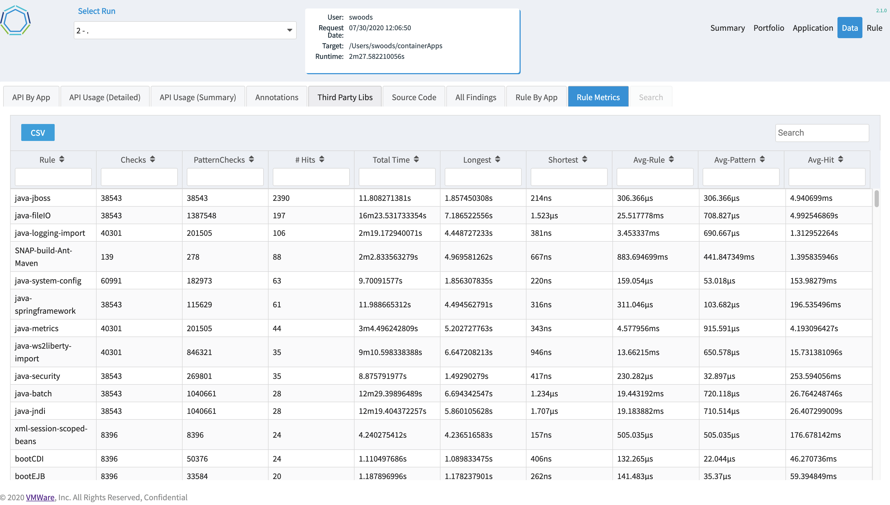

# Cloud Suitability Analyzer (CSA) User Manual


| Date         | Action                       | Author   |
| ------------ | ---------------------------- | -------- |
| Jul 30, 2020 | Prep for open source release | S. Woods |
| Dec 12, 2018 | Converted from readme        | S. Woods |
| Dec 18, 2018 | Added scoring/graphics       | S. Woods |
| Dec 20, 2018 | Added bucketing and profile  | S. Woods |
| Jan 03, 2018 | Added EULA                   | S. Woods |

## License

Cloud Suitability Analyzer is licensed under `SPDX-License-Identifier: BSD-2`

## Purpose

`csa` is built to automatically scan for potential cloud remediation issues (`TAS`) and cloud accommodation issues (`TKG`) embedded in legacy applications. Currently, rules target Java and .Net, however, any language can be targeted by writing rules that identify patterns for that language or platform.

`csa` is entirely data driven using rules comprised of patterns that are first written in `yaml` and then compiled in the `csa` command-line executable. The rule system is flexible and can scan any type of written text, including source code, configuration files, and xml files. Basically, if the file is human-readable text, a rule can be devised that scans the file.

The matching of patterns and lines of application code require millions of pattern comparisons for each portfolio. To ensure performance of scans, `csa` is built to operate in a highly parallel manner. It is built in the Go language, which produces native-code executables for OSX, Windows, and Linux. `csa` will saturate all the CPUs of its host. Accordingly, `csa` benefits from running on multi-CPU machines, conversely, it suffers if it does not have multiple CPUs. **_We recommend at least a 4-core (8 CPU) machine with 16 gig of RAM._**

The patterns are used to perform global scans of all application files, recursively in the directory specified on the command line. The rules are meant to be curated, and over time will change to adapt to the patterns found on cloud migration and containerization engagements. The intention is to create a single composite score that can be used assess cloud suitability, but also, to provide insights into an applications readiness for containerization.

## Binaries/scripts

`csa` binaries run on the following platforms:

| Executable | Platform |
| ---------- | -------- |
| `csa.exe`  | Windows  |
| `csa-l`    | Linux    |
| `csa`      | OSX      |

## Installation

Download from here:

[https://github.com/vmware-samples/cloud-suitability-analyzer/releases](https://github.com/vmware-samples/cloud-suitability-analyzer/releases)

There is no real installation process. It is just a matter of deciding on a home directory can copying the files in the `csa` distribution to that directory.

### Setting up environment

To effectively use `csa` from the command-line, it will be helpful not to type in the full path every time. So include `csa's` location in your path.

#### Adding the path on Linux

Change to your home directory.

`cd $HOME`

Open the `.bashrc` file with a text editor.

Add the following line to the file. Replace the <csa directory> with the location directory of `csa`

`export PATH=<csa directory>:$PATH`

Save the file and exit.

Use the source command to force Linux to reload the .bashrc file which normally is read only when you log in each time.

`source .bashrc`

#### Adding the path on OSX

Change to your home directory.

`cd $HOME`

Open the `.bash_profile` file with a text editor.

Add the following line to the file. Replace the <CSA directory> with the location directory of `CSA`

`export PATH=<csa directory>:$PATH`

Save the file and exit.

Use the source command to force Linux to reload the .bashrc file which normally is read only when you log in each time.

`source .bash_profile`

#### Adding path on Windows

[Instructions to change your PATH on Windows 10](https://www.architectryan.com/2018/03/17/add-to-the-path-on-windows-10/)

#### File handles

If you are experiencing errors such as `Too many open files` or `Unable to open database file` you need to increase you open files /maxfiles ulimit.

If you are attempting to run `csa` on a large directory or set of directories this limit need to be set very high.

##### MAC OSX Sierra/High Sierra

###### Limited Temporary Fix

Set ulimit to 20000

```bash
 ulimit -n 20000
```

> **Note**: This fix will only live as long as the current shell!

##### Persistent Fix _(more flexible...lets you set the limit higher. Requires Reboot!)_

1. You have to create a file in your root Library directory. Specifically => `/Library/LaunchDaemons/limit.maxfiles.plist`

> **Note**: ensure (owner: root:wheel, mode: 0644) see steps below

2. Place the following into the file (set the limits as your desire). The settings below were tested against a portfolio of 36317 files with 7,331,920 lines of code.

```xml
<?xml version="1.0" encoding="UTF-8"?>
<!DOCTYPE plist PUBLIC "-//Apple//DTD PLIST 1.0//EN"
        "http://www.apple.com/DTDs/PropertyList-1.0.dtd">
<plist version="1.0">
  <dict>
    <key>Label</key>
    <string>limit.maxfiles</string>
    <key>ProgramArguments</key>
    <array>
      <string>launchctl</string>
      <string>limit</string>
      <string>maxfiles</string>
      <string>262144</string>
      <string>524288</string>
    </array>
    <key>RunAtLoad</key>
    <true/>
    <key>ServiceIPC</key>
    <false/>
  </dict>
</plist>
```

3. Make sure to set the permissions on the file correctly

```bash

=> sudo chown root:wheel /Library/LaunchDaemons/limit.maxfiles.plist
=> sudo chmod 0644 /Library/LaunchDaemons/limit.maxfiles.plist

```

4. Reboot your machine

### Getting help from `csa`

`csa` has several major operating modes with thier own associated commands. You can see a list of the command by using `CSA help`

| Command    | Description                                                              |
| ---------- | ------------------------------------------------------------------------ |
| bins       | Controls the creation of bins, which group similar applications together |
| rules      | Add, edit, delete rules in the field, no need to rebuild executable.     |
| naturalize | Future feature design to use machine learning to find bounded contexts   |
| git        | Run git forensics reports                                                |
| search     | Access the indexed search capabilties from the command line              |
| analyze    | Default command, scan a directory tree and apply rules                   |
| ui  | Launch a local web server listening at localhost:3001                    |

If you want help on any of these commands simple type CSA help and the command name, such as:

`csa help rules`

### Cloning portfolios

`csa` expects to find a single application per sub-directory, if there are additional application in directory beneath the top directory, they will be considered as one application. This behavior can be controlled using configuration files. See below.

### Using configuration files

Configuratoin files give you full control over how `csa` processes your application portfolio.

The table below describes the settings that are available:

| Setting            | Description                                                  |
| ------------------ | ------------------------------------------------------------ |
| runName            | Specify a run number, `.` lets the number be set by `CSA`    |
| applications       | A collection of application meta-data                        |
| Name               | The name of the application, overrides directory name        |
| Path               | Directory where your application exists                      |
| business-domain    | The domain or the department/region of the application       |
| business-value     | A number that indicates the value of the app to the business |
| dir-exclude-regex  | A regex that describes directories that should be ignored    |
| include-file-regex | A regex that includes files from processing                  |
| exclude-file-regex | A regex that excludes files from processing                  |

#### Sample file

```json
{
    "runName": ".",
    "applications": [
        {
            "Name": "App1",
            "Path": "/Users/swoods/pvtl/portfoliosmall-shortNames/App1",
            "business-domain": "",
            "business-value": 0,
            "dir-exclude-regex": "^([.].*|target|classes|bin|test|node_modules|eclipse|out)$",
            "include-file-regex": ".*",
            "exclude-file-regex": "^(.*[.](exe|png|tiff|tif|gif|jpg|jpeg|bmp|dmg|mpeg)|[.].*|CSA-config[.](yaml|yml|json))$"
        },
        {
            "Name": "App8",
            "Path": "/Users/swoods/pvtl/portfoliosmall-shortNames/App8",
            "business-domain": "",
            "business-value": 0,
            "dir-exclude-regex": "^([.].*|target|classes|bin|test|node_modules|eclipse|out)$",
            "include-file-regex": ".*",
            "exclude-file-regex": "^(.*[.](exe|png|tiff|tif|gif|jpg|jpeg|bmp|dmg|mpeg)|[.].*|csa-config[.](yaml|yml|json))$"
        }


```

## Scoring system

Think of the scoring system as a measurement of relative effort to remediate an application to cloud-readiness. We use three loosely applied scales aligned with how often we expect to find a particular pattern in an applications source code.

| Occurance               | Score Range |
| ----------------------- | ----------- |
| Once per application    | 100-1000    |
| Once per file           | 10 - 100    |
| Multiple times per file | 1 - 10      |

If the finding is really a positive, such as the discovery of spring boot pattern, then we make the number a negative. Since all scores are subtracted from a perfect score of `10`, a negative score is essentially a positive.

For each application, once we add up the counts multiplied by the score we typically find a very wide range of scores between applications. Some may score a 50, while others may score 30,000. This stems from the fact that scoring is driven by lines of code per file. File size in software follows a `log-normal` distribution. So if we count anything related to file size, we will get a log-normal distribution. It looks like this:


_Figure 1: Log-normal distribution_

If we want to take the average, the median, or the standard deviation we need a normal distribution. A normal distribution looks like this:


_Figure 2: Normal distribution_

It's shaped like a bell and is sometimes called a bell-curve. Ever have a teacher that said they would grade you on a curve? This is that curve. Many human phenomena share this distribution. Take a room full of randomly selected people and ask them their height, you'll get a normal curve.

How do we reshape our curve? Since it is `log-normal`, really normal with a skew, we need a way to reshape it. This is very simple, we just take the base 10 logarithm of each number, in this case our total effort score.

###Default Model
As discussed earlier, `csa's` scoring system is externalized into a `yaml` files. The model also includes a set of thresholds to suggest depositions. These thresholds are experimental for the moment.

```yaml
name: Default
#--- Although other models can be build, there always has to be
#    a Default model
max-score: 10
ranges:
  - type: sloc
    #--- Valid types include:
    #    sloc:  Software Lines of Code
    #    raw:   Raw score
    #.   bv:    Business value of app
    start: "0"
    end: int.max
    #--- describe a continuum of range bins
    ranges:
      #--- Bin description
      #    For any raw score between 0 and 100, Deploy to TAS, regardless
      #    of buiness score
      - type: raw #--- raw score bin range
        start: int.min #    start of raw bin
        end: "100" #    end of raw bin
        ranges:
          - type: bv #--- start of business value bin range
            start: flt.min #    start of bv range
            end: flt.max #    end of bv range
            outcome: #
              calculate: true
              #--- expression can be a complex formula that is based upon
              #    a combination of
              expression: max_score - log(10,raw_score)
              recommendation: Deploy to TAS

      #--- Bin description
      #    For any raw score between 101 and 100000
      #    If BV less than 5, Rehost to TKG
      #    If BV more than 5, Refactor to TAS
      - type: raw
        start: "101"
        end: "10000"
        ranges:
          - type: bv
            start: flt.min
            end: "5.00"
            outcome:
              calculate: true
              expression: max_score - log(10,raw_score)
              recommendation: Rehost to TKG
          - type: bv
            start: "5.01"
            end: flt.max
            outcome:
              calculate: true
              expression: max_score - log(10,raw_score)
              recommendation: Refactor to TAS

      #--- Bin description
      #    For any raw score between 10001 and 10000000
      #    If BV less than 5, Rehost to TKG
      #    If BV more than 5, Refactor to TAS

      - type: raw
        start: "10001"
        end: "10000000"
        ranges:
          - type: bv
            start: flt.min
            end: "5.00"
            outcome:
              calculate: true
              expression: max_score - log(10,raw_score)
              recommendation: Rehost to TKG
          - type: bv
            start: "5.01"
            end: flt.max
            outcome:
              calculate: true
              expression: max_score - log(10,raw_score)
              recommendation: Refactor to TAS

      #--- Bin description
      #    For any raw score greater than 10000001
      #    If BV less than 5, Rehost to TKG
      #    If BV more than 5, Refactor to TAS

      - type: raw
        start: "10000001"
        end: int.max
        ranges:
          - type: bv
            start: flt.min
            end: "5.00"
            outcome:
              calculate: true
              expression: max_score - log(10,raw_score)
              recommendation: Rehost to TKG
          - type: bv
            start: "5.01"
            end: flt.max
            outcome:
              calculate: true
              expression: max_score - log(10,raw_score)
              recommendation: Refactor to TAS
```

## Adding rules

An important design requirement for `csa` was the ability to change rules in the field, without the need to recompile the executable. This requirement is driven by the realization that many customer may have in-house libraries that have `wrapper` classes and functions to simplify the use of other frameworks. As such, these wrapper classes may hide critical patterns. With this capability, those internal libraries can be scanned first and then the rules may be augmented to look for additional patterns. The following process details the steps required to do this.

1. Export the rules currently contained inside the `CSA` executable

   `csa rules export -–output-dir=./rules`

2. Add whatever rules you want to add to the rules directory that was just created. You may edit existing rules, as well.

3. Run the following commands

   To import rules, you'll need to ensure a `bins` directory is first exported. The following command will export a `bins.yaml` file to the default location of `~/csa-reports`. You only have to do this once unless you intend to modify or create new bins.

   `csa bins export`

   You may then import rules with the following command.

   `csa rules import –-rules-dir=./rules`

   All bins declared in the `bins.yaml` file are validated. As such, all tags specfified in each `bin` must be present in the rules. If you intend to drop any or all of the standard rules, you'll need to remove bins from the `bins.yaml` file that depend on the rule tags.

4. Open a shell window (bash, MingW, git bash, powershell, etc...)

5. Run `csa help` with no parameters and you'll see usage instructions.

6. To target the current directory and analyze it simply type

   `csa -p .`

   The `-p` tell `csa` to treat each sub directory as a stand-alone application. Otherwise, the sub directories score will be rolled into a single application. In other words, the sub-directories are considered parts of a single application.

7. To target a directory with source code simple run

   `csa -p <path>` or
   `csa analyze -p <path>`

   In most usages it is expected that the user has `git` cloned multiple applications into a single directory and therefore each of those sub-directories is a single application.

## Targeting an ear/war/jar

If no source code is available, you can decompile the ear, war, or jar files. To do so, you'll need the jar file `fernflower.jar` that is bundled in the `csa` download. We suggest putting the jar in the same directory as the `csa` executable, but this can be overridden with the `--fern-jar-path` flag.

1. Run `csa` and provide the fully qualified path to the "jar"

   `csa analyze -p ~/resteasy-spring-2.3.8.Final-redhat-3.jar`

## Tool output

`csa` provides various useful outputs as it processes applications. These can be useful in understanding the results of the scan.

- Command `csa` is executing
- Critical directories
- Number of applications discovered
- Total files found in each application sub-directory
- Percent progress for each scan
- Software Lines of Code (SLOC) summary

While the scan occurs, `csa` is also loading a Sqlite database called `csa.db`. The default location is in the same directory in which the `csa` executable is located. When you first download `csa`, the `csa.db` does not exist, it is created the first time you run `csa`, your first run with be labeled `run 1` and each subsequent run will be incremented. You can have as many run's as you like in `csa.db` If you want to start with an empty `csa.db` you can delete or rename the file.

**_NOTE: If you download a new version of `csa` you will need to delete/rename the current `csa.db` to have any new rules appear in `csa`._**

## Rules

What is a Rule? A rule is in simplest terms a description of something that you want `csa` to detect. This description is structured so that `csa` can easily understand it but is designed to be flexible and extensible.

**Important Note** : Rules and analysis data are intentionally ephemeral from the perspective of `csa` and the baseline code. **_If you update rules, as discussed above, you'll want to keep them in some version controlled system, such as git. They represent valuable insight into your portfolio's profile._**

### Understanding rules

#### Rule model

| Attribute      | Type                     | Description                                                                                                                                                                                                    | Required (y/n) | Default                                               | Overridable (y/n) |
| -------------- | ------------------------ | -------------------------------------------------------------------------------------------------------------------------------------------------------------------------------------------------------------- | -------------- | ----------------------------------------------------- | ----------------- |
| Name           | string                   | The name of the rule. Can be meaningful or not but must be unique! And must match the name of the yaml file.                                                                                                   | Y              |                                                       | N                 |
| FileType       | string                   | The file extension the rule will target. I.E. `java` for `.java` files! Value should not include the dot (period). This can also be a regular expression. I.E. `xm[li]` would match both `xml` and `xmi` files | N              | Rule will apply to all files if no value is specified | N                 |
| Target         | enum                     | This is the target of the rule. Valid values: File,Line. File = rule will apply to filenames only. Line = rule will be applied against every line of content within the file.                                  | Y              |                                                       | N                 |
| Type           | enum                     | This specifies the type or behavior of the rule. Valid values: regex, simple-text, simple-text-ci, starts-with, starts-with-ci, ends-with, ends-with-ci, contains, contains-ci                                 | Y              |                                                       | Y                 |
| DefaultPattern | string                   | Pattern with a placeholder (%s) for substitution of "Pattern" values. I.E. "[ .]%s[ (]". This does not only apply to Regex rules but can also be used for others like a StartsWith such as 'org.json.%s'       | N              |                                                       | Y (pattern)       |
| Advice         | string                   | Any advice on how to remediate this finding for cloud compatibility. This value is used if the specific pattern does not have advice.                                                                          | N              |                                                       | Y                 |
| Score          | int                      | A value indicating how this finding impacts cloud compatibility. At this time we have not settled on a scoring model so ...                                                                                    | N              |                                                       | Y                 |
| Category       | string                   | The category of the rule. Simply a text marker to allow for grouping during analysis in csa. I.E. For the API rules this cotains the API name                                                               | N              |                                                       | N                 |
| Criticality    | enum                     | A t-shirt size of the impact of the finding. Valid values: High, Medium, Low. Used for dashboard in csa                                                                                                     | N              |                                                       | Y                 |
| Tags           | array of Tag objects     | Tags is a collection (0-n) of string values that can be used for grouping/slicing/ect... during analysis in csa                                                                                             | N              |                                                       | Y                 |
| Recipes        | array of Recipe objects  | Recipes is a collection (0-n) of URI values pointing at applicable recipes to aid in remediation of the finding                                                                                                | N              |                                                       | N                 |
| Patterns       | array of Pattern objects | Patterns contains the patterns (1-n) that will be used to match against filenames/line data and result in findings                                                                                             | Y (at least 1) |                                                       | N                 |

#### Pattern model

| Attribute   | Type                 | Description                                                                                                                                                                                                 | Required (y/n) | Default |
| ----------- | -------------------- | ----------------------------------------------------------------------------------------------------------------------------------------------------------------------------------------------------------- | -------------- | ------- |
| Value       | string               | This is the actual pattern value! It will be sustituted into or the default pattern or the overidding pattern.                                                                                              | Y              |         |
| Type        | enum                 | This specifies the type or behavior of the pattern. Over-rides the rule type. Valid values: regex, simple-text, simple-text-ci, starts-with, starts-with-ci, ends-with, ends-with-ci, contains, contains-ci | Y              |         | Y |
| Pattern     | string               | Pattern with a placeholder (%s) for substitution of Value. I.E. "[ .]%s[ (]". This does not only apply to Regex rules but can also be used for others like a StartsWith such as 'org.json.%s'               | N              |         | Y (pattern) |
| Advice      | string               | Any advice on how to remediate this finding for cloud compatibility. Overrides any advice provided at the rule level.                                                                                       | N              |         | Y |
| Score       | int                  | A value indicating how this finding impacts cloud compatibility. At this time we have not settled on a scoring model so ...Overrides any score provided at the rule level.                                  | N              |         | Y |
| Criticality | enum                 | A t-shirt size of the impact of the finding. Valid values: High, Medium, Low. Used for dashboard in csa. Overrides any Criticality provided at the rule level.                                           | N              |         | Y |
| Tags        | array of Tag objects | Tags is a collection (0-n) of string values that can be used for grouping/slicing/ect... during analysis in csa. Overrides any tags provided at the rule level.                                          | N              |         | Y |

#### Tag model

| Attribute | Type   | Description                                         | Required (y/n) | Default |
| --------- | ------ | --------------------------------------------------- | -------------- | ------- |
| Value     | string | the string you are tagging the rule or pattern with | N              |         |

#### Recipe model

| Attribute | Type   | Description                                   | Required (y/n) | Default |
| --------- | ------ | --------------------------------------------- | -------------- | ------- |
| URI       | string | A `uri` for the recipe to resolve the finding | N              |         |

#### Example Rules (yaml)

##### Line level Regex

This is the default annotations rule. It is only be applied against `.java` files, will be matched against every line in the file and detects this use of the annotations listed under patterns.

```yaml
name: annotations
filetype: java
target: line
type: regex
defaultpattern: ^.*@%s$
criticality: medium
tags:
  - value: annotations
patterns:
  - value: DeclareRoles
  - value: DenyAll
  - value: PermitAll
  - value: RolesAllowed
  - value: RunAs
  - value: Stateless
  - value: Stateful
  - value: MessageDriven
  - value: Entity
  - value: Init
  - value: Remove
  - value: ActivationConfigProperty
  - value: Local
  - value: Remote
  - value: LocalHome
  - value: RemoteHome
  - value: TransactionManagement
  - value: TransactionAttribute
  - value: PostActivate
  - value: PreTASsivate
```

##### File Target

This rule only gets applied against java files and detects the presence of pattern named under patterns section.

```yaml
name: java-iop
filetype: java$
target: line
type: regex
advice: Move to cloud friendly alternatives
defaultpattern: "^.*[ .]%s[ (.].*"
effort: 100
readiness: 6
category: iop
tags:
  - value: api
  - value: protocol
  - value: ejb
  - value: non-standard
patterns:
  - value: PortableRemoteObject
  - value: CodecFactory
  - value: CodecOperations
  - value: TransactionService
  - value: ServiceContext
  - value: TaggedComponent
  - value: TaggedProfile
```

### Rules management

#### Exporting

So, now you understand rules. What rules come by default? Or what do the current set of rules that `csa` is using look like? Let's export them!

Run the `csa` rules command with the export sub-command. By default rules will export to the default output-dir. You can override where they will go with the --output-dir flag or the --rules-dir flag. By default they will be exported as yaml with each rule in a separate file. If you prefer json or only working with a single file there are command flags to control this behavior. run ``csa`help rules export` for details.

```
usage: csa rules export [<flags>] [<name>]

export rule(s) from the database
```

```bash
==> csa rules export
DBEngine: sqlite Name: csa.db Version: 3.23.1
Successfully exported [47] rules @ [csa-reports/rules]
```

```bash
==> csa rules export
DBEngine: sqlite Name: csa.db Version: 3.23.1
Successfully exported [47] rules @ [csa-reports/rules]
```

#### Creating/Updating/Importing rules

So, you can now see the rules that come by default. You want to change one, edit the file and update the rule. You want to create one, create a new file with the appropriate structure or add the rule to an existing file. Then run the `csa rules import` command. By default all rules in the --rules-dir will be imported or you can specify a rule name as an argument to the command. There are command flags to control directory where rules will be read and whether rules will be replaced or updated. Run `csa help rules import` for details.

```
usage: csa rules import [<flags>] [<name>]

import rule(s) into the database. By default rules will be added/updated rather than replace existing
```

```bash
==> csa rules import --rules-dir=csa-reports/rules
DBEngine: sqlite Name: csa.db Version: 3.23.1
Successfully imported [47] rule(s) found @[csa`csa`-reports/rules]
```

> **Note**: If importing more than one rule for file ==> If file format is yaml follow the standard yaml multi-document format of separating documents with `---`. If file format is json then just put the rule (object) in the file as a distinct object. Json really doesn't support more than one top level object in a file but that's ok! :). For example of how to create a multi-doc file run the export with the flag to create a single file and review!

#### Deleting/Removing

You have a rule you don't want anymore. Or, for some reason, you want a clean slate...

##### Delete a rule

```
usage: csa rules delete <name>

delete a rule in the database
```

```bash
==> csa rules delete annotations
DBEngine: sqlite Name: csa.db Version: 3.23.1
Deleting rule [annotations]...done!
```

> **Note**: If the rule is found you will receive an indication it is deleted. If it is not found...you won't see any indication other than a clean exit(0) from the CLI

##### Delete All Rules (caution advised!)

```
usage: csa rules delete-all

delete all rules in the database!
```

```bash
==> csa rules delete-all
DBEngine: sqlite Name: csa.db Version: 3.23.1
Delete All Rules! Are you sure(y/n)? y
All Rules Successfully Deleted!

```

> **Note**: Rule 'filenames' are unimportant and have no bearing on rule behavior and are only important to the OS to disambiguate one file from another. Rule 'names' are only important from the perspective of they must be unique.

## Application Archetypes

### Bucketing of applications by tags

All rules in `csa` have any number of `tags` assocatied with them. A `tag` just assoiciates a concept with the rule, such a `jni` or `corba`. At a higher level, we can think of a group of tags can further identify an architecture archetype or a bucket of similar applications. `csa` uses a single `yaml` file (`bins/bins.yaml`) to describe the archetypes as seen in the excerpt below:

```yaml
name: TKG
tags:
- name: Docker
  type: OR
- name: stateful
  type: AND
- name: javaee
  type: AND
- name: fullprofile
  type: AND
- name: jni
  type: OR
- name: nonstandard-protocol
  type: OR
- name: corba
  type: OR

---
name: TAS
tags:
- name: webprofile
  type: OR
- name: spring
  type: OR
- name: spring-boot
  type: OR
- name: webcontainer
  type: OR
- name: rest
  type: OR
- name: jar
  type: OR

.
.
.

```

## CSA Web Interface

### Overview

The `cas ui` command launches a browser-based visual explorer. You'll see `csa` write out some status information then the last line `Using Http FileSystem`. This is your indication that `csa ui` is waiting for you to directory your browser to `localhost:3001`

```bash
Csa: 1.63.0-rev.2 DBEngine: sqlite-3.25.2	DBName: csa.db
User: swoods
Command: ui
User-Home: /Users/swoods
DB Path: /Users/swoods/af/csa.db
Rules-Dir: /Users/swoods/csa/rules
OutputPath: /Users/swoods/csa/csa-reports
Exe Path: /Users/swoods/csa
Tmp Path: /var/folders/w6/3lp91tmn6b51wbqlzn2v6ywc0000gn/T/386908506

Using Http FileSystem!
```

We'll walk through all the pages of information available for your exploration. A note about features that are available throughout:

- For tabular data, most columns are searchable and sortable. You can also export the data to csv files for further analysis.

- Many of the graphics have a hover capbility that helps to identify more detailed information. This feature is very helpful when you have many applications on the Summary page scatter plot.

### Summary Page

The Summary page is a high level view of your entire portfolio of applications. Notice the combo box in the upper left hand corner. If you have run several scans, each will be given a sequential run number starting at 1. `csa` always shows you it's latest run. You can select previous runs using thia control.

To the right of the combo box, there's a summary providing some information about the run you've selected.

The page selector has the summary page showing and highlighted in green. To select other pages, simple click on the one you want.

Just above the page selector you'll the see the current `csa` version number. Should you have problems always make sure you convey the version number to whomever you reach out to for help.

A series of infomation boxes divide the page showing high level statistics.

| Box Title | Meaning                                               |
| --------- | ----------------------------------------------------- |
| APPS      | Total nunber of applications scanned                  |
| LOCS      | Total lines of code found in portfolio                |
| FILES     | Total number of files in portfolio                    |
| FINDINGS  | Total number of findings that were triggered by rules |

The table below the information boxes has following columns:

| Column          | Description                                                             |
| --------------- | ----------------------------------------------------------------------- |
| Application     | Name of directory or the application in the config file if there is one |
| LOC             | Lines code source code                                                  |
| Files           | Total number of files                                                   |
| Raw Score       | Unadjusted score                                                        |
| Scoring Model   | Currently there is only one `Default`                                   |
| Technical Score | The overall calculated techncial score of the application               |


### Portfolio Page

The Portfolio page gives a view of langages and APIs found across your portofolio. The top two bar charts present the top 5 languages and top 5 APIs found in your entire portfilio.

The bottom two bar charts present a selectable view with language and APIs, reflecting their presence, the top 10, found within each application.



### Application Page

The Application page allows us to focus on a single application and dig deeper into its composition. Selecting an application in the combo box will show all the details for that application, such SLOC (Software Lines of Code) and number of files.

| Box Name | Description                                                    |
| -------- | -------------------------------------------------------------- |
| INFO     | Rule findings that have a 0 score, they are informational only |
| LOW      | Low effort score (1 - 3)                                       |
| MEDIUM   | Medium effort score (4 - 6)                                    |
| HIGH     | High effort score (7 - 10)                                     |
| Total    | Total number of finding                                        |
| Score    | Score for this application, hover to see the raw score         |

- Note: See scoring section for more detail. Ranges can change based upon the anticipated frequency of occurance.

Let's skip down to the table, then come back to the rectangles and ovals.

The tables contents are:

| Column    | Description                                                         |
| --------- | ------------------------------------------------------------------- |
| ID        | Sequential ID number assocated with finding                         |
| Level     | Level of effort score or information only                           |
| Category  | Category of finding                                                 |
| Value     | The pattern that triggers the rule, or a number indicating LOC, etc |
| File Name | File name where pattern was discovered                              |
| Line #    | Line number where pattern occurred                                  |
| Effort    | Relative effort to remediate finding                                |
| # Tag     | Total number of tags associated with finding                        |
| # Recipes | Total number of recipies associated with finding                    |

- Note: `ID`, `# Tag`, and `# Recipes` are colored green, indicating more information available with a click.


Now lets focus on the rectangular and oval figures. The rectangular boxes represent architecture archetypes. Archetypes can the thought of as buckets to group similar technology stacks together. Click a rectangular box and its assoicated tags will also turn green. This allows us to think of large portofilio was a collection of a smaller number of similar applications with similar approaches to either remediate (`TAS`) or to accomodate (`TKG`).

The next two tabs give us a tree layout by language and api. The point here is to have a quick visual read on the anatomy of the application.




### Data Page

The Data page provides several views into detailed findings for your entire portfolio. Using sorting and filtering you can explorer your application in several dimensions:

#### API by APP

In `csa`, the primary component of scores is the individual rules that indicate patterns found in source code require remediation (`TAS`) or acommodation (`TKG`). While a single number score is useful in comparison with other applications, when considering a single application it is helpful to know the subcomponents of the score. This matrix shows the raw scores, with each column indicating an effort score. By horizontally scrolling you can better understand the score breakdown.


#### API Usage (Detailed)

At a deeper level, the API Usage (Detailed) tab shows all details collected during the application scan. Using filters and sorting you can explorer all details of portfolio scans.



#### API Usage (Summary)

The API Usage (Summary) presents a quick high level summary of the APIs found in your entire portfolio.


#### Annotations

Here is collected all the annotation throughout your portfolio that may present challenges or considerations in your move to the cloud.


#### Third Party Libs

Not all third party libraries behave well in the cloud, so it is helpful to know which are in your applications. They can be found here.



#### Source Code

Sometimes, it's easy to forget how many languages are in your application. Here's is a breakdown of all those languages and the amount of each.


### Rules Page

If you're writing rules for `csa` this tab is very helpful to know how the rules are performing. Poorly written regular expression can seriously affect `csa's` performance, this is where you to to find bottlenecks.


